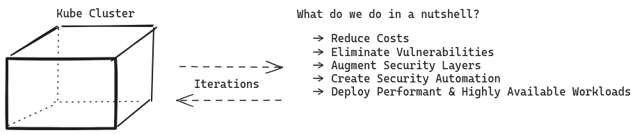
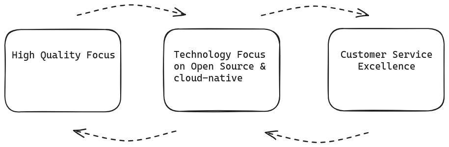

# Simplify Kubernetes Developments. 
## Identify Cluster Vulnerabilities in Minutes, For Free. {#h2--value-proposition}

> We provide flexible Kubernetes-as-a-Service solutions for dynamic organizations.
You do not have to invest huge resources to make your cluster work exactly as it should.
With security in mind at all time, we help you configure, deploy, and run you Kubernetes Cluster with ease and simplicity.

## Who are we and who are we not?

We are fully certified Kubernetes Specialists with CKA, CKAD and CKS Specializations under our belt.
With almost a decade of experience in containerised applications, micro-services and service oriented architectures (SOA), we are well placed in the market to consult, advise, build and deploy highly secure, scalable and highly available Kubernetes workloads for you.

- We are NOT a SaaS company.
- We use cloud-agnostic technologies and do NOT party with any cloud provider out there. Our Kubernetes Solutions are in effect native, built-in Kubernetes Solutions without any extra layer or dependency built on top of it. 
- We are fully independent.
- We like simplicity, honesty, integrity, professionalism and high quality work.
- We do NOT use lock-in contracts and there are NO minimum requirements (e.g. time-bound) or expensive clauses to be aware of with us.

## Value Proposition Drivers

### Focus on High Quality

We deliver profound insights about systems, how they work, how they are exposed to security vulnerabilities and we define and implement technical solutions with an iterative process. This means defining, redifining and iterating again and again.

### Technology Focus

We use the best available OSS and cloud-native technologies. We use various tools for security forensics and possess deep knowledge of each one of them. We have no affiliations with security companies or SaaS products so we provide an unbiased, uncompromising set of security services around your needs. There are NO lock-ins with us.

### Client Focus

We aim to achieve and maintain customer service excellence and we involve
stakeholders in design and development decisions. No more lengthy processes to get things done. 
From day 0, you will notice that client attention and satisfaction comes on top of our priorities.
The client is the most important priority we will ever have. 

Email Us Now for A Quick and Free Consultation.
