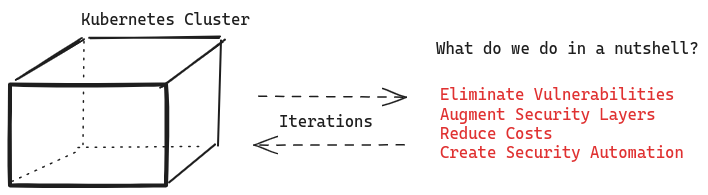

# Kubernetes Specialists

Fully certified Kubernetes specialists **(CKA / CKAD / CKS)** with a focus on security.

Run independent, cloud-agnostic Kubernetes forensics against vulnerabilities and mis-configurations at different levels of your technology stack.

We provide both advisory and high-quality development solutions to secure your cluster and workloads with no lock-in strategies and no strings attached.

### The problem we want to address with Kubernetes

Kubernetes is a powerful open source platform to orchestrate containerised applications. Its success and wide adoption have led to a plethora of services, plugins and technologies around its ecosystem, resulting in market offerings that are flooding CTOs and developers' desktops, in an attempt to keep up with constanly new things to know or learn.

Kubernetes developments are not easy. The complex intricacies of the platform coupled with OS Kernel dependencies and distributed microservices runtime issues, make Kubernetes environments susceptible to cyberattacks from different fronts, vulnerabilities and most ot the time, human-led preventable mis-configurations.

We offer unbiased, independent, and no-frills services around security. We help diagnose vulnerabilities at across different layers (e.g. cluster, microservice, image binaries, OS), using non-commercial, best-in-class open-source software. Furthermore, we integrate with your existing teams or as independent kubernetes administrators to implement necessary changes to harden your systems, making them more resilient to potential attacks.

### Security Model: a Unique Approach

Security is a complex business. In order to capture the inherent complexities around setup, system hardening and maintenance, we adopt a security model that combines several principles and well-known frameworks into a single, easy-to-digest "context-driven" path to security.

The security model is extremely simplified. What is important to note here is that our model quickly identifies the context where immediate actions are needed. These "contexts" enviroments are three:

- Application and Microservice Layer;
- Orchestrator Level and;
- System Layer, which includes Kernel space components, Drivers and Hardware.

### How is our model different from others?

We use several principles of security:

- AAAA
- POLP or Principle of Least Privilege
- Zero-Trust Security

The added "A" in the AAA model (Authentication, Authorization, Auditing) stands for Admission Controllers, native built-in kubernetes controllers which also includes third-party webhooks for mutating or validating a request. 

What's more is that for each context (System and OS, Orchestrator, Microservices), we apply security in depth, creating redundant layers (defense in depth) by superimposing another model of Security: the Cloud Native Computing Foundation Security (CNCF) Model.

The CNCF Model represents a typical DevOps pipeline, which includes four different but interrelated phases:

- Development
- Distribution
- Deployment and
- Runtime phases:

    - Access
    - Compute and
    - Storage.

Thus, we take the CNCF Model and iterate through its different phases.These phases may reference a step which was previously taken or may give a completely different perspective to what the previous models had led us to. Thus, it provides us with more powerful insights and road maps to implement.

For example, the RUNTIME phase suggests we go back to Access, hence our initial AAAA implementation. The Compute area of the RUNTIME phase suggests we look into isolating mechanisms to block or reduce sys calls to the OS kernel. Or to restrict resource usage with admission plugins (Admission Controllers) like ResourceQuotas or LimitRanges. These are just some examples which are not exhaustive by any means and that suggests how iterations work at different infrastructure layers.

## Value Proposition Drivers

### Focus on High Quality

We deliver profound insights about systems, how they work, how they are exposed to security vulnerabilities and we define and implement technical solutions with an iterative process. This means defining, redifining and iterating again and again.

### Technology Focus

We use the best available OSS and cloud-native technologies. We use various tools for security forensics and possess deep knowledge of each one of them. We have no affiliations with security companies or SaaS products so we provide an unbiased, uncompromising set of security services around your needs. There are NO lock-ins with us.

### Client Focus

We aim to achieve and maintain customer service excellence and we involve
stakeholders in design and development decisions. The client is the most
important priority we will ever have.